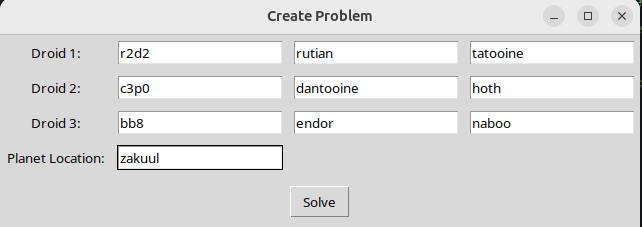
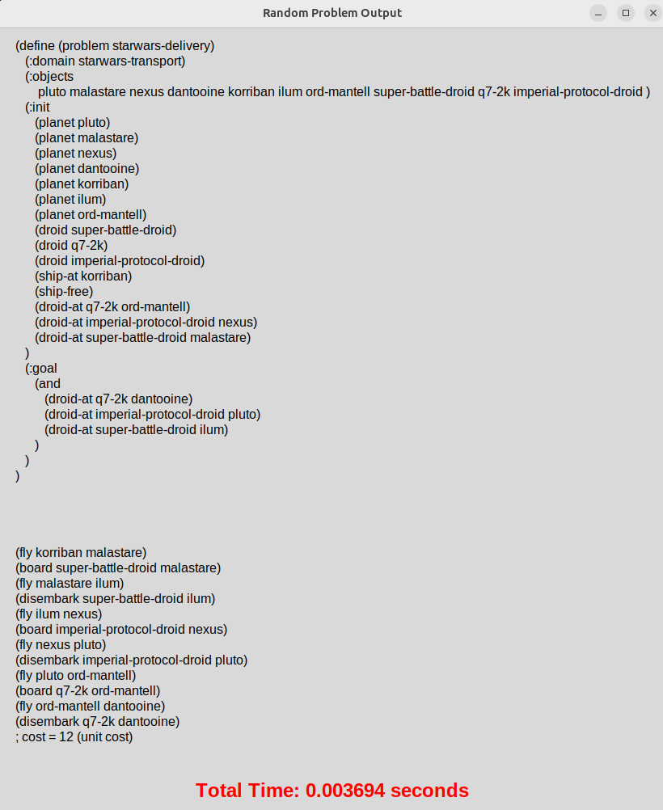
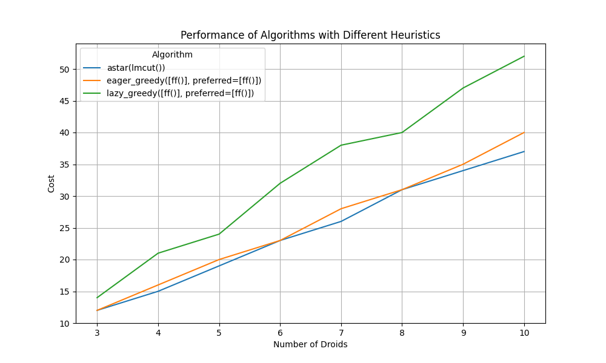

# Star Wars PDDL Strikes Back

## Introduction
The project is a planning application based on PDDL (Planning Domain Definition Language), which generates random planning problems and uses search algorithms to find solutions. The user can create and solve planning problems involving droids, where each droid has a location and a destination point (home). Algorithms such as A* and Greedy are used to find efficient solutions, and the results are displayed in the form of graphs illustrating the performance of the algorithms depending on different problem sizes (number of droids).

## Design
This application is implemented using a **Model-View-Controller (MVC)** architecture.

### Model
The Model component is responsible for the core application logic and data handling. It generates planning problems, handles PDDL files, and defines the configuration of the droids and planets.

### Controller
The Controller component manages interactions between the Model and the View. It facilitates solving planning problems, processing results, and generating visualizations.

### View
The View component provides a graphical user interface (GUI) for users. It displays problem information, solution steps, and algorithm performance graphs.

## Implementation
The project integrates planning capabilities using PDDL and ensures modularity through the MVC architecture.

### Model
The Model component handles:
- `generate_random_problem`: Creates random planning problems by assigning droids random locations and destinations.
- `generate_problem`: Generates PDDL problem files for specific user-defined inputs.
- `write_problem`: Saves generated problems in PDDL format to disk.
- Predefined sets of planets and droids stored in `config.py`.

### Controller
The Controller component implements the core logic for solving problems and analyzing performance. Key functionalities include:
- Solving problems using the **Fast Downward** PDDL planner with algorithms such as `astar(lmcut())`, `eager_greedy([ff()])`, and `lazy_greedy([ff()])`.
- Parsing planner outputs to extract solution steps, costs, and execution times.
- Generating performance graphs using matplotlib to compare algorithms.

### View
The View component provides an interactive GUI using **Tkinter**. Features include:
- Generating random problems or creating custom problems with user-defined parameters.
- Viewing detailed solutions, including the problem definition, steps, and total execution time.
- Visualizing algorithm performance graphs comparing solution costs for varying problem sizes.

### Planner Integration
The project uses the **Fast Downward** planner to process PDDL files. The domain and problem files are dynamically generated to represent the droid transportation problem. The domain includes the following:

**Predicates**:
- `(planet ?p)`: Represents a planet.
- `(droid ?d)`: Represents a droid.
- `(ship-at ?p)`: Represents the spaceship's location.
- `(droid-at ?d ?p)`: Represents a droid's current location.
- `(ship-free)`: Indicates whether the spaceship is available.
- `(carrying ?d)`: Indicates if the spaceship is carrying a specific droid.

**Actions**:
- `fly`: Moves the spaceship between planets.
- `board`: Loads a droid onto the spaceship.
- `disembark`: Unloads a droid from the spaceship.

### Visualization
The performance of algorithms is analyzed by solving problems with varying numbers of droids. The results are displayed as graphs comparing:
- Solution costs for different algorithms.
- Execution times across problem sizes.

These visualizations help evaluate the efficiency of planning algorithms.

## Results
The interface is a graphical user interface (GUI) that facilitates creating and solving transportation problems in a *Star Wars*-themed planning scenario.

  
   
  <em>Main Screen</em>

  
   
  <em>Problem Creation Screen</em>

  
   
  <em>Solution Display Screen</em>

### Graph Overview
The graph titled **Performance of Algorithms with Different Heuristics** compares the performance of three algorithms for solving transportation planning problems, measured in terms of **cost**.

  

#### X-Axis: Number of Droids
The x-axis represents the **number of droids** in the problem. Each point corresponds to a specific problem size, ranging from 3 to 10 droids. As the number of droids increases, the complexity of the problem also grows, making it more challenging for algorithms to find solutions.

#### Y-Axis: Cost
The y-axis indicates the **cost of the solution** generated by each algorithm. A lower cost reflects a more efficient solution. Cost typically represents the number of steps or actions required to achieve the goal in the problem.

#### Algorithms Compared
The graph compares the following three algorithms:

**A* with LM-Cut Heuristic (Blue Line):**
- **Description:** An optimal search algorithm that uses the LM-Cut heuristic to guarantee the lowest-cost solution.
- **Performance:** Produces consistently lower costs than the other algorithms. A* is ideal for scenarios requiring optimal solutions, though it may require more computational time.

**Eager Greedy with FF Heuristic (Orange Line):**
- **Description:** A non-optimal algorithm that balances speed and solution quality, using the FF heuristic.
- **Performance:** Yields slightly higher costs than A* but is faster. This makes it a good trade-off between efficiency and quality.

**Lazy Greedy with FF Heuristic (Green Line):**
- **Description:** The fastest algorithm, using a lazy evaluation strategy with the FF heuristic.
- **Performance:** Produces the highest costs, especially as the number of droids increases. It prioritizes speed over quality.

#### Key Observations
1. **Cost Growth:** The cost increases for all algorithms as the number of droids grows, reflecting the increasing complexity of the problem.
2. **Performance Comparison:** A* consistently achieves the lowest costs, followed by Eager Greedy, while Lazy Greedy performs the worst in terms of cost.
3. **Algorithm Divergence:** The cost difference between algorithms becomes more pronounced as the problem size increases. For smaller problems, the algorithms' performance is relatively close.

#### Conclusion
- If **optimal solutions** are required, **A* with LM-Cut** is the best choice, albeit with a longer computation time.
- For a **balance between speed and quality**, **Eager Greedy with FF Heuristic** is recommended.
- If **speed is critical**, **Lazy Greedy** can be used, but the solution quality may degrade significantly as the problem size increases.
