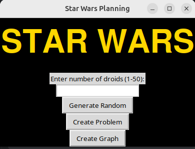
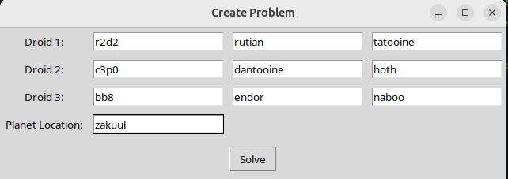
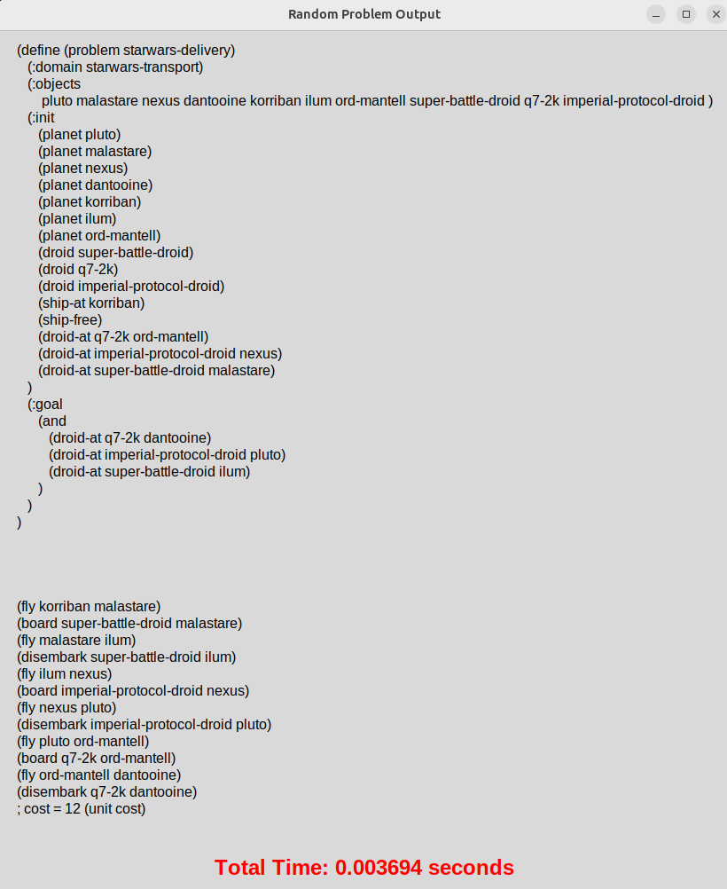
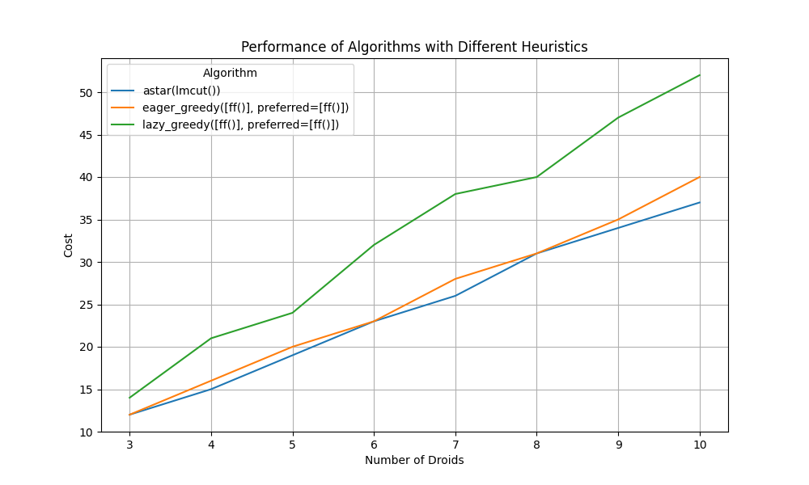

# STAR WARS A LOGISTICS HOPE

## CE FACE
Proiectul este o aplicație de planificare bazată pe PDDL (Planning Domain Definition Language), care generează probleme de planificare aleatoare și utilizează algoritmi de căutare pentru a găsi soluții. Utilizatorul poate crea și rezolva probleme de planificare cu droiduri, unde fiecare droid are o locație și un punct de destinație (acasă). Algoritmi precum A* și Greedy sunt utilizați pentru a găsi soluții eficiente, iar rezultatele sunt afișate sub formă de grafice ce ilustrează performanța algoritmilor în funcție de diferite dimensiuni ale problemelor (numărul de droiduri).
## DOMAIN

### Predicates
- `(planet ?p)`  
  Represents a planet.

- `(droid ?d)`  
  Represents a droid.

- `(ship-at ?p)`  
  Represents the current location of the spaceship.

- `(droid-at ?d ?p)`  
  Represents the location of a droid.

- `(ship-free)`  
  Indicates if the spaceship is free to carry a droid.

- `(carrying ?d)`  
  Indicates if the spaceship is carrying a specific droid.

### Actions

#### Fly
- **Parameters**: `?from` (planet), `?to` (planet)
- **Preconditions**:
  - The spaceship is at planet `?from`.
  - Planet `?from` and planet `?to` exist.
- **Effects**:
  - The spaceship is now at planet `?to`.
  - The spaceship is no longer at planet `?from`.

#### Board
- **Parameters**: `?d` (droid), `?p` (planet)
- **Preconditions**:
  - Droid `?d` is at planet `?p`.
  - The spaceship is at planet `?p` and is free to carry a droid.
- **Effects**:
  - The spaceship starts carrying droid `?d`.
  - Droid `?d` is no longer at planet `?p`.
  - The spaceship is no longer free.

#### Disembark
- **Parameters**: `?d` (droid), `?p` (planet)
- **Preconditions**:
  - The spaceship is carrying droid `?d` and is at planet `?p`.
- **Effects**:
  - Droid `?d` is now at planet `?p`.
  - The spaceship is free.
  - The spaceship no longer carries droid `?d`.


```pddl
(define (domain starwars-transport)
   (:predicates
      (planet ?p)              ; Represents a planet
      (droid ?d)               ; Represents a droid
      (ship-at ?p)             ; Current location of the spaceship
      (droid-at ?d ?p)         ; Location of a droid
      (ship-free)              ; Indicates if the spaceship is free to carry a droid
      (carrying ?d))           ; Indicates if the spaceship is carrying a specific droid

   ; Fly action: The spaceship moves from one planet to another
   (:action fly
       :parameters (?from ?to)
       :precondition (and (planet ?from) (planet ?to) (ship-at ?from))
       :effect (and (ship-at ?to)
                    (not (ship-at ?from))))

   ; Board action: Load a droid onto the spaceship
   (:action board
       :parameters (?d ?p)
       :precondition (and (droid ?d) (planet ?p) (droid-at ?d ?p)
                          (ship-at ?p) (ship-free))
       :effect (and (carrying ?d)
                    (not (droid-at ?d ?p))
                    (not (ship-free))))

   ; Disembark action: Unload a droid from the spaceship at the current planet
   (:action disembark
       :parameters (?d ?p)
       :precondition (and (droid ?d) (planet ?p) (carrying ?d) (ship-at ?p))
       :effect (and (droid-at ?d ?p)
                    (ship-free)
                    (not (carrying ?d)))))

```


cand deschizi aplicatia


cand creezi problema


vezi solutia


vezi graph in care se compara aloritmi
